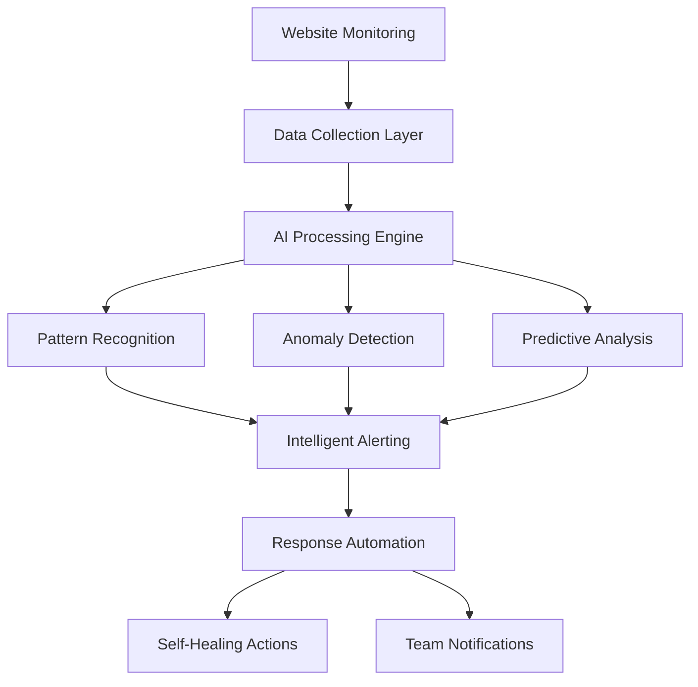

# Integrating AI Agents for Enhanced Website Monitoring

Incorporating AI agents into your website monitoring strategy can significantly enhance your ability to automate processes and receive instant feedback and alerts. Platforms like N8N allow you to connect your monitoring service with AI agents, streamlining operations and improving response times. As exit1.dev continues to evolve, AI integration represents one of the most promising frontiers for making monitoring smarter, more responsive, and genuinely helpful for development teams.

## Benefits of AI Integration

Integrating AI agents with your website monitoring service offers several advantages:

- **Automation**: Automate routine tasks and processes, freeing up time for more critical activities
- **Instant Feedback**: Receive real-time insights and alerts, enabling quicker decision-making
- **Improved Accuracy**: AI can analyze data more accurately and consistently than manual methods
- **Pattern Recognition**: Identify trends and anomalies that humans might miss
- **Predictive Capabilities**: Anticipate issues before they become critical problems
- **Context-Aware Responses**: Generate intelligent responses based on historical data and current conditions

## Technical Architecture for AI-Powered Monitoring

### Core Components

A robust AI-integrated monitoring system consists of several key components working together:



**Data Collection Layer**
- Real-time metrics from monitoring endpoints
- Historical performance data
- User behavior analytics
- System logs and error reports
- External factors (traffic spikes, seasonal patterns)

**AI Processing Engine**
- Machine learning models for pattern analysis
- Natural language processing for log analysis
- Time series forecasting algorithms
- Correlation analysis between metrics
- Confidence scoring for predictions

**Response System**
- Automated incident classification
- Intelligent alert routing
- Self-healing action triggers
- Escalation management
- Performance optimization recommendations

## How to Connect AI Agents

To connect AI agents with your website monitoring service, follow these steps:

### 1. Choose an AI Platform

Select a platform that supports integration with your monitoring service. Popular options include:

**N8N (Workflow Automation)**
- Visual workflow builder
- Pre-built monitoring integrations
- Custom webhook support
- Local and cloud deployment options

**Zapier (SaaS Integration)**
- Extensive app ecosystem
- Simple setup process
- Good for basic automation
- Limited for complex logic

**Custom Solutions**
- Full control over AI logic
- Integration with specific ML models
- Optimal performance for your use case
- Requires more development effort

### 2. Set Up Triggers

Configure triggers that activate AI processes based on specific monitoring events:

```javascript
// Example N8N workflow trigger for exit1.dev webhooks
const monitoringTrigger = {
  webhook: {
    method: 'POST',
    path: '/monitoring-alert',
    responseMode: 'onReceived'
  },
  conditions: [
    {
      field: 'status',
      operation: 'equal',
      value: 'DOWN'
    },
    {
      field: 'responseTime',
      operation: 'greaterThan',
      value: 30000
    }
  ]
};

// AI processing node
const aiProcessor = {
  type: 'function',
  code: `
    const { OpenAI } = require('openai');
    
    // Analyze the incident with AI
    const analyzeIncident = async (alertData) => {
      const prompt = \`
        Analyze this website monitoring alert:
        URL: \${alertData.url}
        Status: \${alertData.status}
        Response Time: \${alertData.responseTime}ms
        Error: \${alertData.error}
        
        Historical pattern: \${alertData.historicalData}
        
        Provide:
        1. Likely root cause
        2. Severity assessment (1-5)
        3. Recommended immediate actions
        4. Estimated resolution time
      \`;
      
      const response = await openai.chat.completions.create({
        model: 'gpt-4',
        messages: [{ role: 'user', content: prompt }]
      });
      
      return response.choices[0].message.content;
    };
    
    return await analyzeIncident($json);
  `
};
```

### 3. Automate Responses

Define automated responses to alerts, such as sending notifications or executing corrective actions:

**Intelligent Alert Classification**
```python
# Example Python script for AI-powered alert classification
import openai
import json

class IntelligentAlerting:
    def __init__(self, api_key):
        self.client = openai.OpenAI(api_key=api_key)
    
    def classify_alert(self, alert_data):
        """Classify alert severity and suggest actions using AI"""
        
        prompt = f"""
        Classify this monitoring alert and suggest actions:
        
        Alert Details:
        - URL: {alert_data['url']}
        - Status Code: {alert_data['status_code']}
        - Response Time: {alert_data['response_time']}ms
        - Error Message: {alert_data['error']}
        - Time: {alert_data['timestamp']}
        
        Historical Context:
        - Average Response Time: {alert_data['avg_response_time']}ms
        - Uptime Last 30 Days: {alert_data['uptime_percentage']}%
        - Recent Incidents: {alert_data['recent_incidents']}
        
        Provide a JSON response with:
        {{
            "severity": "critical|high|medium|low",
            "category": "infrastructure|application|network|external",
            "likely_cause": "description",
            "immediate_actions": ["action1", "action2"],
            "escalation_needed": true/false,
            "estimated_impact": "description"
        }}
        """
        
        response = self.client.chat.completions.create(
            model="gpt-4",
            messages=[{"role": "user", "content": prompt}],
            response_format={"type": "json_object"}
        )
        
        return json.loads(response.choices[0].message.content)
    
    def generate_runbook(self, classification):
        """Generate step-by-step troubleshooting guide"""
        
        prompt = f"""
        Generate a detailed troubleshooting runbook for:
        Severity: {classification['severity']}
        Category: {classification['category']}
        Likely Cause: {classification['likely_cause']}
        
        Provide numbered steps for:
        1. Initial assessment
        2. Diagnosis procedures
        3. Resolution steps
        4. Verification methods
        5. Prevention measures
        """
        
        response = self.client.chat.completions.create(
            model="gpt-4",
            messages=[{"role": "user", "content": prompt}]
        )
        
        return response.choices[0].message.content
```

## Advanced Use Cases

### Automated Incident Response

Here are some practical use cases for AI integration in website monitoring:

**Intelligent Root Cause Analysis**
When multiple alerts fire simultaneously, AI can correlate them to identify the actual root cause:

```yaml
# Example workflow configuration
incident_analysis:
  triggers:
    - multiple_alerts_within: "5 minutes"
    - alert_count_threshold: 3
  
  ai_analysis:
    - correlate_alerts_by_timestamp
    - analyze_dependency_graph
    - check_external_service_status
    - review_recent_deployments
    
  output:
    - root_cause_probability
    - affected_services_list
    - recommended_actions
    - escalation_requirements
```

**Predictive Scaling Recommendations**
AI can analyze traffic patterns and predict when you'll need to scale resources:

```javascript
// Predictive scaling analysis
const predictiveScaling = {
  inputs: [
    'current_traffic_pattern',
    'historical_scaling_events',
    'seasonal_trends',
    'upcoming_marketing_campaigns',
    'server_resource_utilization'
  ],
  
  predictions: {
    traffic_forecast: '24_hour_ahead',
    scaling_recommendations: 'infrastructure_changes',
    cost_optimization: 'resource_efficiency',
    risk_assessment: 'potential_bottlenecks'
  }
};
```

**Automated Performance Optimization**
AI can continuously optimize your website's performance based on monitoring data:

```python
# Performance optimization AI
class PerformanceOptimizer:
    def analyze_performance_trends(self, metrics):
        """Analyze performance patterns and suggest optimizations"""
        
        analysis_prompt = f"""
        Analyze these performance metrics over the last 30 days:
        
        Response Times: {metrics['response_times']}
        Error Rates: {metrics['error_rates']}
        Traffic Patterns: {metrics['traffic_patterns']}
        Resource Usage: {metrics['resource_usage']}
        
        Identify:
        1. Performance bottlenecks
        2. Optimization opportunities
        3. Infrastructure recommendations
        4. Code-level improvements
        5. Monitoring gaps
        """
        
        # Process with AI and return actionable insights
        return self.ai_client.analyze(analysis_prompt)
```

### Enhanced Reporting

**AI-Generated Incident Reports**
Automatically generate comprehensive incident reports:

```javascript
const generateIncidentReport = async (incidentData) => {
  const reportPrompt = `
    Generate a professional incident report for:
    
    Incident: ${incidentData.title}
    Duration: ${incidentData.duration}
    Affected Services: ${incidentData.affected_services}
    Root Cause: ${incidentData.root_cause}
    Resolution: ${incidentData.resolution_steps}
    
    Include:
    - Executive summary
    - Timeline of events
    - Impact analysis
    - Root cause analysis
    - Resolution details
    - Prevention measures
    - Action items
  `;
  
  const report = await ai.generateReport(reportPrompt);
  return {
    report: report,
    stakeholders: incidentData.stakeholders,
    action_items: extractActionItems(report)
  };
};
```

## Implementation Strategies

### Starting Simple

**Phase 1: Basic Automation**
1. **Webhook Integration**: Connect exit1.dev alerts to AI processing
2. **Simple Classification**: Categorize alerts by severity and type
3. **Automated Notifications**: Send enriched alerts to appropriate teams
4. **Basic Correlation**: Group related alerts together

**Phase 2: Intelligence Layer**
1. **Pattern Recognition**: Identify recurring issues and trends
2. **Predictive Alerts**: Warn about potential issues before they occur
3. **Smart Escalation**: Automatically escalate based on business impact
4. **Performance Insights**: AI-generated optimization recommendations

**Phase 3: Autonomous Operations**
1. **Self-Healing**: Automatically resolve common issues
2. **Dynamic Scaling**: AI-driven infrastructure adjustments
3. **Proactive Maintenance**: Schedule optimizations during low-traffic periods
4. **Continuous Learning**: Improve AI models based on outcomes

### Best Practices for AI Integration

**Data Quality**
- Ensure monitoring data is clean and consistent
- Implement proper data validation and sanitization
- Maintain historical data for pattern analysis
- Regular model retraining with new data

**Security Considerations**
- Secure API connections between monitoring and AI systems
- Implement proper access controls for AI-generated actions
- Regular security audits of AI integration points
- Data privacy compliance for monitoring data

**Human Oversight**
- Maintain human approval for critical actions
- Implement confidence thresholds for AI decisions
- Regular review of AI-generated insights
- Fallback procedures when AI systems are unavailable

## Measuring AI Integration Success

### Key Performance Indicators

**Operational Efficiency**
- Mean Time to Detection (MTTD) improvement
- Mean Time to Resolution (MTTR) reduction
- False positive alert reduction
- Automated resolution rate

**Business Impact**
- Uptime improvement percentage
- Customer satisfaction scores
- Operational cost reduction
- Team productivity metrics

**AI Performance**
- Prediction accuracy rates
- Confidence score distributions
- Model drift detection
- Continuous learning effectiveness

### Continuous Improvement

```python
# AI performance monitoring
class AIPerformanceMonitor:
    def track_prediction_accuracy(self, predictions, outcomes):
        """Track how accurate AI predictions are over time"""
        accuracy_metrics = {
            'overall_accuracy': calculate_accuracy(predictions, outcomes),
            'precision_by_category': calculate_precision_by_category(),
            'recall_rates': calculate_recall_rates(),
            'false_positive_rate': calculate_false_positives()
        }
        return accuracy_metrics
    
    def identify_improvement_areas(self, metrics):
        """Use AI to identify where the AI can improve"""
        analysis = f"""
        Analyze these AI performance metrics:
        {metrics}
        
        Identify:
        1. Areas with declining accuracy
        2. Categories with high false positive rates
        3. Opportunities for model improvement
        4. Training data gaps
        """
        return self.meta_ai.analyze(analysis)
```

## The Future of AI-Powered Monitoring

### Emerging Trends

**Large Language Models (LLMs) for Operations**
- Natural language queries for monitoring data
- Conversational incident management
- AI-generated documentation and runbooks
- Voice-activated monitoring controls

**Edge AI for Monitoring**
- Local AI processing for faster response times
- Reduced data transfer costs
- Improved privacy and compliance
- Offline operation capabilities

**Multi-Modal AI Integration**
- Visual analysis of monitoring dashboards
- Audio alert processing and generation
- Integration with video surveillance systems
- Comprehensive sensory monitoring

## Conclusion

By integrating AI agents with your website monitoring service, you can enhance efficiency, accuracy, and responsiveness, ensuring a seamless experience for your users. The key is starting with simple automations and gradually building more sophisticated AI capabilities as your team becomes comfortable with the technology.

exit1.dev is designed to work seamlessly with AI integration platforms, providing the reliable data foundation that AI systems need to make intelligent decisions. Whether you're using N8N for workflow automation or building custom AI solutions, our monitoring platform provides the real-time, accurate data that makes AI-powered operations possible.

The future of website monitoring is intelligent, automated, and proactive. By embracing AI integration today, you're not just improving your current operations—you're building the foundation for the autonomous monitoring systems of tomorrow.

---

*Ready to supercharge your monitoring with AI? [Explore exit1.dev's AI-ready monitoring platform](https://exit1.dev) and start building intelligent automation workflows that keep your sites running smoothly.* 